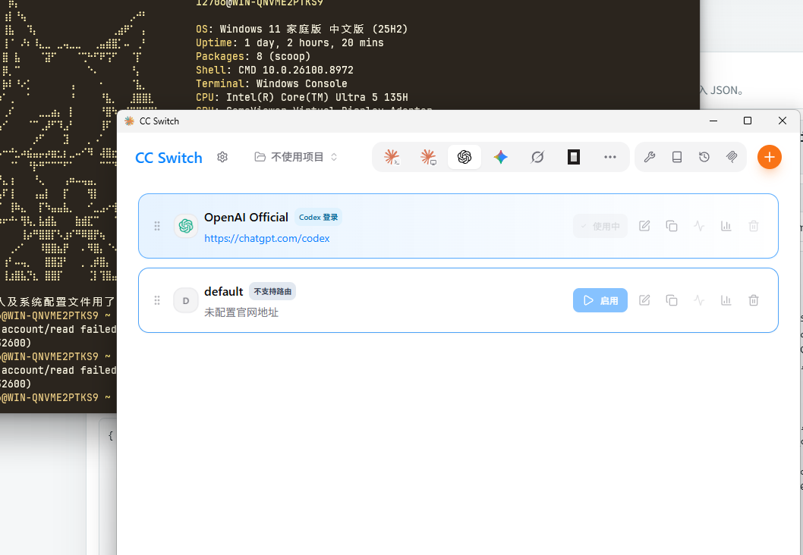
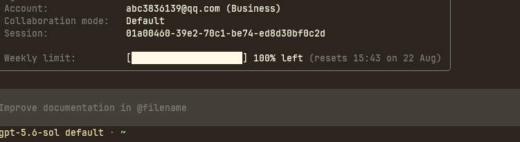
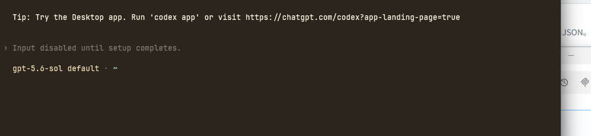
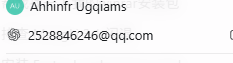
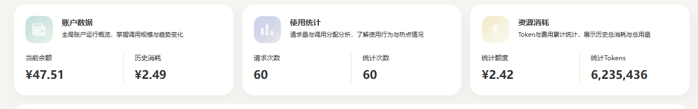

# 拼车 ChatGPT Team 跑 Codex（2026 年 8 月）

用合租的 ChatGPT Team 账号跑 Codex（CLI + 桌面 App），实测可行。

把一张 `sub2api` 账号卡，通过 **CC Switch** 完成导入切换，再用 **codex-auth** 把 CLI 的登录搬到桌面 App。一条龙打通。

## 为什么用拼车？

| 方式 | 月费（参考） | 特点 |
|------|------|------|
| 官网直订 | $20+ | 国内卡难绑、贵 |
| Google Play 土区 | ~¥98 | 合法合规，需办单标卡（见另一篇土区教程） |
| 拼车合租 | 按天/周摊，几元到几十元 | 便宜，但共享限额、有封号/限流风险 |

> 拼车 = 多人共用一个 Team 订阅的 token，价格低但 **5 小时窗口限额是共用的**，撞满就限流。

## 准备工作

| 物品 | 说明 |
|------|------|
| **Node.js + npm** | 跑 `codex`、`codex-auth` |
| **Codex CLI** | `npm install -g @openai/codex` |
| **代理** | FlClash / Clash Verge，系统代理指向 `127.0.0.1:7891` |
| **账号文件** | 车头发来的 `sub2api` JSON |

## 操作步骤

### Step 1：拿到账号文件

车头发来的通常是一个 `.json`。本次用的账号是 `abc3836139@qq.com`（Team 版），文件长这样：

```jsonc
{
  "accounts": [
    {
      "credentials": {
        "access_token": "eyJhbGciOi...",       // 登录票据（长期）
        "id_token": "eyJhbGciOi...",           // 身份票据（短期）
        "refresh_token": "rt.1.AAC...",        // 刷新票据
        "email": "abc3836139@qq.com",
        "chatgpt_account_id": "8fdbed60-1fce-4f68-be23-4c9ed98be9c2",
        "chatgpt_user_id": "user-lBLQjtHw8wA7xQYbrYBGByr1",
        "expires_at": 1787587805,               // 过期时间戳 ≈ 2026-08-24
        "model_mapping": {
          "gpt-5.2": "gpt-5.2",
          "gpt-5.3-codex": "gpt-5.3-codex",
          "gpt-5.4": "gpt-5.4",
          "gpt-5.4-mini": "gpt-5.4-mini",
          "gpt-5.5": "gpt-5.5",
          "gpt-5.6-luna": "gpt-5.6-luna",
          "gpt-5.6-sol": "gpt-5.6-sol",
          "gpt-5.6-terra": "gpt-5.6-terra",
          "gpt-image-2": "gpt-image-2"
        }
      },
      "type": "oauth",
      "platform": "openai",
      "plan_type": "team",
      "name": "8月15日00.09发车-7d-abc3836139 team-8fdbed-BCA00E86BE17"
    }
  ],
  "card_code": "team-8fdbed-BCA00E86BE17",
  "format": "sub2api",
  "proxies": []
}
```

三个要点：

- **它是一张「账号卡」，不是 API Key**。里面装的是 OAuth 登录票据。
- **它只给 OpenAI / GPT 模型（Codex）用**，不能给 Claude 用。
- `plan_type: team` + 名字里的「发车 / 7d」= 拼车号，租期一般 7 天。

### Step 2：装 CC Switch 并导入

1. 从 [CC Switch Releases](https://github.com/farion1231/cc-switch/releases) 下载安装（本次用的是 v3.19.2）
2. 首次启动会自动「播种」官方供应商（Claude / OpenAI(codex) / Gemini / Grok）
3. 用「导入」把 Step 1 的 JSON 导进去



判断是否导入成功：CC Switch 的数据在 `~/.cc-switch/cc-switch.db`（SQLite），看 `providers` 表里 `settings_config.auth.accounts[0].name` 是不是 `8月15日00.09发车-7d-abc3836139 team-8fdbed-BCA00E86BE17`。

> Codex 有**两套互相独立的登录存储**，这是后面所有坑的根源：
>
> | 文件 | 用途 |
> |------|------|
> | `~/.codex/auth.json` | **CLI** 的当前登录 |
> | `~/.codex/accounts/registry.json` | **桌面 App** 的账号注册表 |
>
> CLI 能跑 ≠ App 有账号，两处要分别打通。

### Step 3：用 CLI 验证

终端跑：

```bash
codex
```

正常会进入交互界面，默认模型是 `gpt-5.6-sol`，底部会显示账号和每周限额：



如果看到 **`Input disabled until setup completes.`** + 一个 `chatgpt.com/codex` 链接，说明 Codex 认为你没登录：



> 原因基本是：token 失效 / 没切换到正确账号 / 供应商没切成功。用 `codex-auth list` 看当前激活的是不是 `abc3836139@qq.com`。

### Step 4：用 codex-auth 搬到桌面 App

CLI 能跑了，想用桌面 App，就装 [loongphy/codex-auth](https://github.com/loongphy/codex-auth) 把登录「搬」进 App 的注册表。

```bash
npm install -g @loongphy/codex-auth
npm install -g @loongphy/codext      # 可选

codex-auth list                      # 首次会自动识别 auth.json 里的账号
codex-auth import ~/.codex/auth.json # 没自动识别就手动导入
codex-auth switch abc3836139@qq.com  # 切到拼车号
```

`list` 里带 `*` 的就是激活账号，本次输出长这样：

```
* 01 abc3836139@qq.com      Business  100% ...
  02 avavyes3@gmail.com     Pro Lite  8% ...
  03 yangzhuo167@gmail.com  Business  401 ...
```

**关键一步：重启 App。** App 只在启动时读注册表，所以：

1. 先 `switch` 好；
2. **彻底关掉 Codex App 再重开**，它才认新账号。

桌面 GUI 的正确入口是 `codex app`，直接 `codex` 是终端 TUI。重启后能看到账号登录成功：



## PAT 账号的坑：CLI 能用，桌面 App 不能用

拼车号现在有**两种格式**，差别很大：

| 格式 | token 样子 | refresh_token | CLI | 桌面 App |
|------|-----------|---------------|-----|----------|
| OAuth | `eyJhbGciOi...`（JWT） | 有 | ✅ | ✅ |
| PAT（个人访问令牌） | `at-...` 短串 | 无 | ✅ | ❌ |

上面 Step 1~4 用的是 **OAuth 格式**（`abc3836139@qq.com`）。后来换的 `gusset_soother_70@icloud.com` 是 **PAT 格式**（`sub2api-account.json`，`access_token` 是 `at-` 开头、没有 `refresh_token`）。

### 现象

- CLI（`codex`）：✅ 正常
- 桌面 App：❌ 读得到账号，但启动时账号校验失败，判「未登录」

### 原因

App 启动会调 `https://chatgpt.com/backend-api/wham/accounts/check` 校验账号，OpenAI 对 PAT token 返回：

```
HTTP 401  "rejected_by_access_enforcement" / "no_matching_rule"
```

PAT token 只对 Codex 的**代码生成接口**有效，过不了 App 的**账号校验**（后者要完整的 OAuth 网页会话）。

### 怎么办

- 只用 CLI → PAT / OAuth 都行。
- 要用桌面 App → **只能 OAuth 格式**，找车头要带 `refresh_token` 的账号。

### 附：PAT 账号怎么手动塞进 App 注册表

codex-auth v0.2.10 还不支持 PAT（`import` 报 `MissingRefreshToken`），要手动写：

1. 在 `~/.codex/accounts/registry.json` 的 `accounts` 里加一条，并把 `active_account_key` 指向它
2. 建一个 `base64("{chatgpt_user_id}::{chatgpt_account_id}").auth.json` 文件，内容照抄 `~/.codex/auth.json`

> 注意：手动塞进去只是让 App「看到」这个账号，**解决不了上面的 401**——PAT 该登不上 App 还是登不上。

## 账号被吊销（401 token_revoked）怎么办

拼车号最常见的坑：**token 被 OpenAI 吊销**。任何请求都返回：

```json
{ "error": { "code": "token_revoked", "message": "Encountered invalidated oauth token for user" }, "status": 401 }
```

（老一点的号是 `token_invalidated`，含义一样。）

### 为什么会被吊销

1. 车头踢人/换人——新乘客发车时旧 token 作废；
2. OpenAI 风控识别出多人共享，直接吊销；
3. 号被用滥了。

### 判断是「死号」还是「还能救」

用 token 直接打接口：

```bash
curl -s -x http://127.0.0.1:7891 \
  -H "Authorization: Bearer <access_token>" \
  "https://chatgpt.com/backend-api/wham/usage"
```

- 返回 `used_percent` + `limit_reached` → 有效；
- 返回 `token_revoked` / `token_invalidated` → 死号。

### 401 可以复活

**token 被吊销 ≠ 账号没了**。车头重新登录一次就能生成新 token（俗称「复活」）。流程：

1. 找车头要新的 `sub2api` JSON（同邮箱同账号，只是 token 换新）；
2. 用上面的 curl 验证新 token；
3. 把新 token 写进 `~/.codex/auth.json` 和 `~/.codex/accounts/<base64(account_key)>.auth.json`（两个文件都要换）；
4. **杀掉 `ChatGPT.exe` 进程再重开 App**。

> 关键坑：桌面 App 的进程名是 **`ChatGPT.exe`**（在 `WindowsApps\OpenAI.Codex` 包里），不是 `codex.exe`。换账号/换 token 后必须杀 `ChatGPT.exe` 重启，否则它带着旧状态一直刷 401。

## API 中转站（OpenAI 兼容）vs 反代（sub2api）

除了「反代 / OAuth 拼车」这一路，还有一类叫 **API 中转站**（OpenAI 兼容网关，如 APINebula）——用自己的 API key，不依赖 OAuth 登录，按 token 计费。

### 两者区别

| | 反代（sub2api / OAuth） | API 中转站（如 APINebula） |
|---|---|---|
| 认证 | OAuth token（拼车号） | 自己的 API key |
| 计费 | 按号租期（7 天） | 按 token 用量 |
| 号会被吊销 | 会（`token_revoked` 频繁） | 不会（key 是自己的） |
| **接续对话** | ✅ 能（走 `chatgpt.com` 会话） | ❌ 不能（无状态 API） |
| 桌面 App | ✅ OAuth 登录 | ⚠️ 受限 |

> 核心差异：**反代能接续对话，中转站不能**。反代走 `chatgpt.com/backend-api` 的会话机制，thread 存在 OpenAI 侧；中转站走 `/v1/responses` 无状态 API，每次请求独立，没有会话可续。

### 消耗示例

实测 60 次请求、约 623 万 token，消耗 ¥2.49 左右，折合约 **¥0.4 / 百万 token**，比 OpenAI 官方 API（¥30+/百万 token）便宜两个数量级：



### 配置（以 APINebula 为例）

`config.toml`：

```toml
model = "gpt-5.6-sol"
model_provider = "nebula"
model_reasoning_effort = "medium"

[model_providers.nebula]
name = "nebula"
base_url = "https://apinebula.ai/v1"
wire_api = "responses"
requires_openai_auth = false      # 关键！不能写 true
env_key = "APINEBULA_API_KEY"     # key 走独立环境变量
```

`auth.json` 留空（`{}`），key 用环境变量传入：

```bash
setx APINEBULA_API_KEY "sk-xxxx"
setx APINEBULA_BASE_URL "https://apinebula.ai/v1"
```

### 关键坑：requires_openai_auth 写 true 会走官方

中转站文档常写 `requires_openai_auth = true`，但**新版 Codex 里 true 的真实含义是「用 OpenAI 认证走官方」**——`base_url` 被忽略，请求全打到 `api.openai.com`，报 `401 invalid_api_key`。

**正确做法**：`requires_openai_auth = false` + `env_key`（独立环境变量），key 跟 OAuth 登录态彻底解耦。

### 能用哪些端

- **CLI**：✅ 实测通过（`provider: nebula`，模型正常返回）
- **VS Code 插件**：✅ 读同一套 config
- **桌面 App**：⚠️ 新版 App 强制 OAuth 登录（启动就调 `chatgpt.com/backend-api/settings/user`，纯 API key 喂不了，报 `no_token_attached`）；即便按文档配上了，**中转站也接续不了对话**，不如反代。

## 常见问题

### 为什么 CLI 能跑、App 里却没有这个号？

因为两者读的是不同文件：CLI 读 `auth.json`，App 读 `accounts/registry.json`。CLI 登录成功后，注册表里不一定有这号，需要 `codex-auth import` + `switch`，再重启 App。

### 模型报限流（rate limit）怎么办？

拼车号多人共用一个 Team 的 5 小时窗口，`codex-auth list` 显示 100% 就是撞满了。等窗口重置，或者 `codex-auth switch` 切到备用号（比如 `avavyes3@gmail.com`）。

### 连不上 OpenAI 怎么办？

确认代理开着，系统代理指向 `127.0.0.1:7891`。CC Switch 默认是直连，需要的话在设置里开「本地代理」。

### 注册表里有旧号切错了怎么办？

```bash
codex-auth remove <邮箱>   # 删掉不用的号，比如 yangzhuo167@gmail.com
codex-auth clean          # 清理 accounts/ 下的备份残留
```

### token 多久过期？

拼车号租期一般 7 天，到期要续。`expires_at: 1787587805` ≈ 2026-08-24。到期前找车头要新的 `sub2api` JSON，重新走一遍 Step 2~4 即可。

## 命令速查

```bash
codex                        # 终端 TUI
codex app                    # 桌面 GUI
codex-auth list              # 列账号（* = 激活）
codex-auth switch <邮箱>       # 切换
codex-auth remove <邮箱>       # 删除
codex-auth clean             # 清理残留
```

## 用过的账号记录

> 备忘：本人用过的拼车号（私有仓库，只给自己看）。

| 邮箱 | 格式 | 结果 |
|------|------|------|
| `abc3836139@qq.com` | sub2api OAuth | `token_invalidated`，死号，已删 |
| `yangzhuo167@gmail.com` | OAuth | 401 死号，已删 |
| `gusset_soother_70@icloud.com` | PAT | CLI 可用，App 登不上，备用 |
| `quincyjohnson0872+punfh@gmail.com` | OAuth | 复活过一次，可用 |
| `peimcvay@gmail.com` | codex 卡密 | 需转换网址生成 synthetic id_token |
| `mariasmithe038+8851@gmail.com` | OAuth | 可用（已换下） |
| `ashtonainsworth4857+vic9j@gmail.com` | OAuth | 当前在用 |

三种格式一句话区分：

- **sub2api OAuth**：带真实 `id_token`，CLI + App 都能直接用；
- **codex 卡密**：不带 `id_token`，要拿卡密去转换网址（`http://xgrok.xdo.icu:18363/`）转成 codex 格式（生成 synthetic id_token）才能用；
- **PAT**：`at-...` 短 token，只能 CLI。

> 补充：除了车头发号，还能**自己登录 ChatGPT 后转号**——浏览器登录 GPT，打开 `https://chatgpt.com/api/auth/session` 复制整段 JSON，丢进本地转换工具 [GPTSession2CPAandSub2API](https://gtxx3600.github.io/GPTSession2CPAandSub2API/) 转成 sub2api / CPA 格式（浏览器本地解析，token 不上传）。

## 免责声明

拼车/合租属于共享订阅，不符合 OpenAI 官方规则，存在封号、掉号、限流风险。本教程仅为个人经验备忘，请自行评估风险；账号与 token 视同密码，请勿外传。
